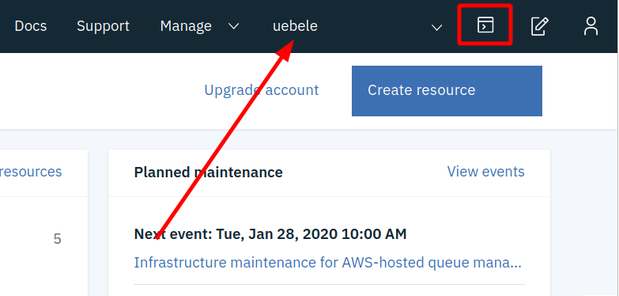
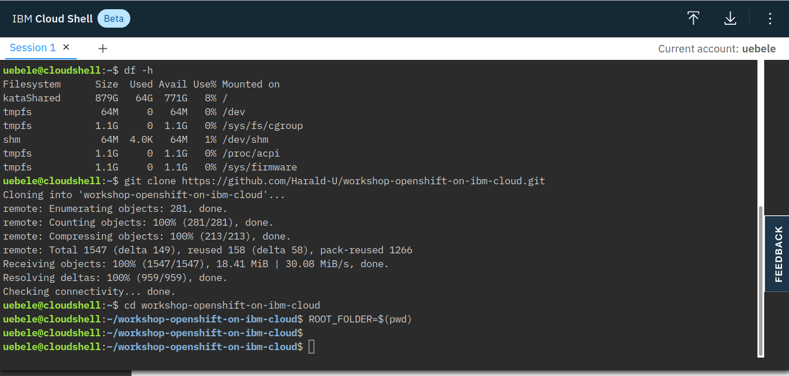

# Prerequisties

## Overview 

An [IBM Cloud account](https://cloud.ibm.com/registration) is needed. 

We will use a shared [OpenShift on IBM Cloud](https://cloud.ibm.com/kubernetes/catalog/openshiftcluster) service on IBM Cloud in this hands-on workshop. You will have been granted access to a pre-configured OpenShift cluster.


## Tools

For the **optional Java developer labs** 2 and 3 you need a local `docker` and `git` installation.

For the rest of the labs we will use the IBM Cloud Shell (Beta):


1. In your browser, login to the [IBM Cloud](https://cloud.ibm.com) Dashboard
2. Make sure you select **your own account** in the account list, then click on the IBM Cloud Shell Icon

   

    Note: Cloud Shell includes 500 MB of temporary storage. Your session closes after 30 minutes of inactivity. If you’re inactive in Cloud Shell for over an hour, your workspace data is removed. It’s also removed if you reach the 4-hour continuous usage or 30-hour weekly usage limits. To track your usage, go to Usage quota in the Cloud Shell menu (3 vertical dots in the upper right corner).

   


## Get the code

In the IBM Cloud Shell execute the following commands:

```
$ git clone https://github.com/Harald-U/workshop-openshift-on-ibm-cloud.git
$ cd workshop-openshift-on-ibm-cloud
$ ROOT_FOLDER=$(pwd)
```


## Verify Access to OpenShift on the IBM Cloud

### Open the OpenShift console. 

1. Logon to the IBM Cloud Dashboard (https://cloud.ibm.com).

2. Select the account given to you by the instructor from the pulldown in the uper right corner.

3. Select **OpenShift** in the 'burger' menu

    

4. Chose **Clusters** and click on your **OpenShift cluster**

    

4. Open the **OpenShift web console**

    

### Get the access token for the 'oc' CLI. 


1. From the dropdown menu in the upper right of the page, click 'Copy Login Command'. Paste the copied command into your terminal in the IBM Cloud Shell.

    

2. Verify 'oc' CLI

    ```
    $ oc login https://c1XX-XX-X.containers.cloud.ibm.com:XXXXX --token=xxxxxx'
    ```

    

---

__Continue with [Lab 4 - Deploying to OpenShift](4-openshift.md)__

