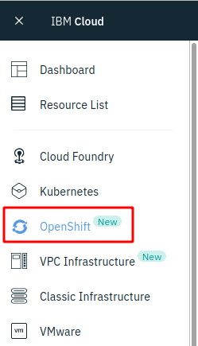

# Prerequisties

## Overview 

An [IBM Cloud account](https://cloud.ibm.com/registration) is needed. 

We will use a shared [OpenShift on IBM Cloud](https://cloud.ibm.com/kubernetes/catalog/openshiftcluster) service on IBM Cloud in this hands-on workshop. You will have been granted access to a pre-configured OpenShift cluster.


## Tools

For the **optional Java developer labs** 2 and 3 you need a local `docker` and `git` installation.

For the rest of the labs we will use the (unofficial) **IBM Cloud Shell**. To access IBM Cloud Shell:

1. Open [https://workshop.shell.cloud.ibm.com/](https://workshop.shell.cloud.ibm.com/)
2. Click `Login` in the upper right corner
3. Login with your IBM Cloud Account / IBM ID
4. If it asks for a passcode, use 'ikslab'
4. Select your account from the pulldown in the upper right corner
5. Click on the Terminal icon next to it


Note: You *could* run the the labs locally on your laptop. But then you will need to install the following tools:

- [docker](https://docs.docker.com/install/)
- [oc](https://cloud.ibm.com/docs/containers?topic=containers-cs_cli_install#cli_oc)
- [git](https://git-scm.com/book/en/v2/Getting-Started-Installing-Git) 
- [curl](https://curl.haxx.se/download.html)
- [maven](https://maven.apache.org/install.html) + JDK
- Optional: Editor, for example [Visual Studio Code](https://code.visualstudio.com/) 

##Get the code

In the IBM Cloud Shell execute the following commands:

```
$ git clone https://github.com/Harald-U/workshop-openshift-on-ibm-cloud.git
$ cd workshop-openshift-on-ibm-cloud
$ ROOT_FOLDER=$(pwd)
```


## Verify Access to OpenShift on the IBM Cloud

### Open the OpenShift console. 

1. Logon to the IBM Cloud Dashboard (https://cloud.ibm.com).

2. Select the account given to you by the instructor from the pulldown in the uper right corner.

3. Select **OpenShift** in the menu

    

4. Chose **Clusters** and click on the **OpenShift cluster**

    

4. Open the **OpenShift web console**

    

### Get the access token for the 'oc' CLI. 


1. From the dropdown menu in the upper right of the page, click 'Copy Login Command'. Paste the copied command into your terminal in the IBM Cloud Shell.

    

2. Verify 'oc' CLI

    ```
    $ oc login https://c1XX-XX-X.containers.cloud.ibm.com:XXXXX --token=xxxxxx'
    ```

    
---


__Continue with [Lab 4 - Deploying to OpenShift](4-openshift.md)__

