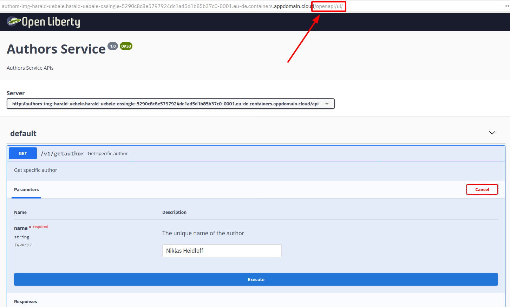

# Lab 5 - Deploying existing Images from Docker Hub

> Deploying existing images to OpenShift: [video (7:09 mins)](https://youtu.be/JhxsS7l6DhA)

## Overview

This is a quick lab that demonstrates how to deploy a public image from Docker Hub onto OpenShift. As starting point an image of the 'authors' microservice from this workshop has already been loaded on Docker Hub.

Note: Not all images from Docker Hub can be used on OpenShift. For example, OpenShift does run containers as 'root' which means that a lot of images from Docker Hub won't start. See the OpenShift [documentation](https://docs.openshift.com/container-platform/3.3/creating_images/guidelines.html) for details.

## Step 1

Open the OpenShift Console from the IBM Cloud OpenShift dashboard.

<kbd></kbd>

## Step 2

Select your own project 'yourfirstname-yourlastname'.

<kbd></kbd>

## Step 3

Click 'Add to Project', followed by 'Deploy Image' in the pop up menu.

<kbd></kbd>

## Step 4

Select 'Image Name', enter 'nheidloff/authors:v1' as the image name, then click the search icon.

<kbd></kbd>

## Step 5

In the 'Deploy Image' dialog, scroll down and change the 'Name' from 'authors' to 'authors-img'. This will also change the 'app' label. Then click on 'Deploy'.

<kbd></kbd>

Navigate back to the overview page.

<kbd></kbd>

## Step 6

Open 'authors-img' and click 'Create Route'.

<kbd></kbd>

## Step 7

Accept the defaults, scroll down and click the 'Create' button (not shown in the screenshot).

<kbd></kbd>

## Step 8

Click on the URL of 'authors-img', this will open the default Open Liberty Welcome page, and append '/openapi/ui' to the URL.

<kbd></kbd>

## Step 9

This opens the Open API user interface to try the REST API.

<kbd></kbd>


## Optional: Use your own Image

If you want you can make changes to the Java code and/or image and push these changes to your own Docker Hub account. In order to do this, you need a Docker Hub account and invoke these commands:

```
$ cd ${ROOT_FOLDER}/deploying-to-openshift
$ DOCKER_ACCOUNT=<your-docker-account>
$ docker login
$ docker build -t $DOCKER_ACCOUNT/authors:v1 .
$ docker push $DOCKER_ACCOUNT/authors:v1
```

---

:star: __Continue with [Lab 6 - Deployments of Code in GitHub Repos](./6-github.md)__
