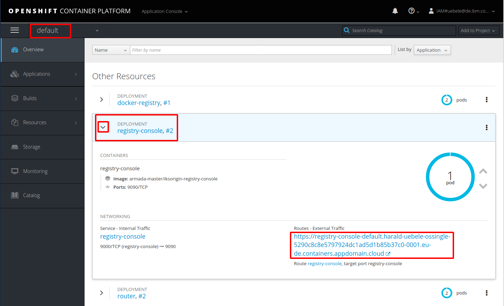
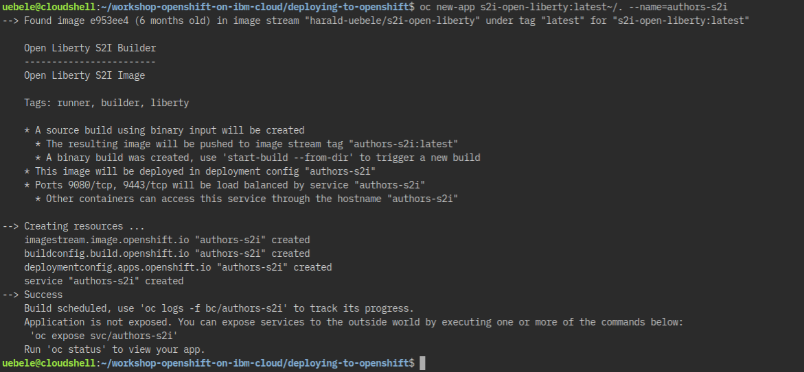

# Lab 7 - Source to Image Deployments

> Source to Image deployments: [video (7:06 mins)](https://youtu.be/p6lVc6MDrcM)

## Overview

OpenShift allows developers to deploy applications without having to understand Docker and Kubernetes in depth. Similarily to the Cloud Foundry 'cf push' experience, developers can deploy applications easily via terminal commands and without having to build Docker images. In order to do this [Source-to-Image](https://github.com/openshift/source-to-image) is used.

Source-to-Image (S2I) is a toolkit for building reproducible container images from source code. S2I produces ready-to-run images by injecting source code into a container image.

In order to use S2I, builder images are needed. These builder images create the actual images with the applications. The builder images are similar to Cloud Foundry buildpacks.

## Deployment of the Open Liberty Builder Image

OpenShift provides several builder images out of the box, for example for Node.js and Wildfly applications. In order to support other runtimes, for example Open Liberty, custom builder images can be built and deployed. Since this workshop uses Open Liberty, we will use a [builder image for Open Liberty](https://github.com/nheidloff/s2i-open-liberty) which needs to be deployed before the actual Open Liberty microservice can be deployed.

To deploy the image builder 'nheidloff/s2i-open-liberty' the OpenShift Web Console is used.


### Step 1

First we need to add the Open Liberty builder image to the OpenShift internal image registry. For reasons unknown, Red Hat decided to place the Image Registry in the default namespace in version 3 of OpenShift. (This has changed in version 4.)

To open the registry console, choose the default project, expand registry-console and click on the URL.

<kbd></kbd>

### Step 2

Click on 'Images', then select your project ('yourfistname-yourlastname') and then click on 'New image stream'. In the dialog use 's2i-open-liberty' as name, select 'Sync all tags ...' from the pulldown, and refer to the image on Docker Hub 'nheidloff/s2i-open-liberty'. Then click 'Create'.

An image stream is an OpenShift abstraction to access images. In this case we are using it to pull images from Docker Hub into the OpenShift registry.

<kbd></kbd>

### Step 3

It will take a moment to pull the image. After this the image will show up in the user interface.

<kbd></kbd>

The other images you see on this page were created during the previous labs.

## Deployment of the Microservice

The previous steps to install the Open Liberty builder image only have to be executed once. After this multiple Open Liberty applications can be deployed without Dockerfiles and yaml files.

### Step 4

The image builder expects a certain directory structure of Open Liberty projects with two files:

* server.xml in the root directory
* *.war file in the target directory

Before the code can be pushed to OpenShift, the 'war' file (Java web archive with microservice) needs to be built with Maven. Note: Maven is installed in the IBM Cloud Shell. If you are not using Cloud Shell you need to have `mvn` installed on your laptop.

```
$ cd ${ROOT_FOLDER}/deploying-to-openshift
$ mvn package
```

After you've run these commands, the file 'authors.war' will appear in the 'target' directory.

### Step 5

Next we create a new OpenShift application (our microservice) in your project.

The first parameter of the `oc new-build` command may look strange: 
the first part (s2i-open-liberty:latest) specifies the Open Liberty builder image, then comes a separator ('~'), then the specification of the local repository '/.' which contains the server.xml and authors.war needed for the build.

```
$ oc new-app s2i-open-liberty:latest~/. --name=authors-s2i
```

After executing these commands you should see this:

<kbd></kbd>

### Step 6

If you look in the OpenShift Web Console now, you will see that the build failed -- which is to be expected:

<kbd></kbd>

Before the microservice can be deployed with the image builder, the code (or more precisely 'authors.war' and 'server.xml') need to be uploaded to OpenShift. This is done via 'oc start-build'.

In the 'oc start-build' command we refer to the code of our Java microservice in the current directory.

```
$ oc start-build --from-dir . authors-s2i
```

After a moment you can see the successful build in the OpenShift Web Console.

<kbd></kbd>

Note that at this point the pod is not running yet as indicated by 'Rolling deployment is running ...'. After you've waited another minute or so, the pod will be ready and the grey circle will turn blue.

### Step 7

In the last step the route has to be created as in the previous labs.

```
$ oc expose svc/authors-s2i
$ oc get route/authors-s2i
```

To test the deployment, append '/openapi/ui' to the URL in the output of 'oc get route/authors-s2i' and open it in a browser.

---


When you go back to the OpenShift Web Console and look in the overview of your project, you will see four instances of the authors microservice, deployed to OpenShift in four different ways:

<kbd></kbd>

---

:star: __Continue with [Lab 8 - Distributed logging with LogDNA and OpenShift on IBM Cloud](8-logdna-openshift.md)__